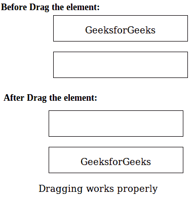

# HTML | ondragend 事件属性

> 原文:[https://www . geeksforgeeks . org/html-ondragend-event-attribute/](https://www.geeksforgeeks.org/html-ondragend-event-attribute/)

当用户完成元素的拖动时，ondragend 事件属性起作用。拖放功能在 HTML5 中很常见。任何元素都可以通过使用 HTML5 的可拖动属性来进行拖动。

**支持的标签:**支持所有 HTML 元素。

**语法:**

```html
<element ondragend = "script">
```

**属性值:**该事件包含单属性*脚本*，在调用 ondragend 事件时有效。

**注意:**默认情况下，图像和链接是可拖动的。

**示例:**

## 超文本标记语言

```html
<!-- HTML code to implement ondragend event using drag
and drop event attribute -->
<!DOCTYPE HTML>
<html>
    <head>
        <title>ondragend Event Attribute</title>
        <style>
            .box {
                width: 30%;
                height: 50px;
                margin:20px;
                border: 1px solid black;
                text-align:center;
            }
        </style>

        <script>

            /* Function to start dragging */
            function starts_drag(event) {
                event.dataTransfer.setData("Text", event.target.id);
                document.getElementById("demo").innerHTML =
                                      "Dragging is in work";
            }

            /* Function to stop dragging */
            function end_drag(event) {
                document.getElementById("demo").innerHTML =
                                    "Dragging works properly";
            }

            /* Function to allow drop content */
            function drop_allow(event) {
                event.preventDefault();
            }

            /* Function to drop the content */
            function drop_event(event) {
                event.preventDefault();
                var data = event.dataTransfer.getData("Text");
                event.target.appendChild(document.getElementById(data));
            }
        </script>
    </head>

    <body>

        <!-- ondragend event starts from here -->
        <div class="box" ondrop="drop_event(event)"
        ondragover="drop_allow(event)">
            <p ondragstart="starts_drag(event)"
                ondragend="end_drag(event)"
            draggable="true" id="gfg">GeeksforGeeks

<p>
        </div>

        <div class="box" ondrop="drop_event(event)"
        ondragover="drop_allow(event)"></div>
        <!-- ondragend event complete here -->

        <p id="demo"></p>

        </center>
    </body>
</html>                               
```

**输出:**



**支持的浏览器:**ondragend 事件属性支持的浏览器如下:

*   谷歌 Chrome 4.0
*   Internet Explorer 9.0
*   Mozilla Firefox 3.5
*   Safari 6.0
*   Opera 12.0