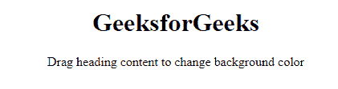
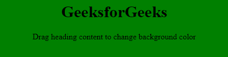
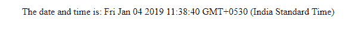

# HTML | ondragenter 事件属性

> 原文:[https://www . geesforgeks . org/html-ondragenter-event-attribute/](https://www.geeksforgeeks.org/html-ondragenter-event-attribute/)

当内容可拖动时，HTML 中的 ondragenter 事件属性起作用。通过将可拖动属性值设置为 true 来创建元素。可拖动属性只能取真值或假值。

**语法:**

```html
<element ondragenter = "script">
```

**属性值:**该属性包含单值*脚本*，在调用 ondragenter 事件属性时生效。

**例 1:**

```html
<!DOCTYPE html>
<html>
    <head>
        <title>
            HTML ondragenter Event Attribute
        </title>

        <!-- script to add background color -->
        <script>
            function MyFunction() {
                document.getElementById("geeks").style.backgroundColor
                            = "green";
            }
        </script>
    </head>

    <body id = "geeks" style = "text-align:center">

        <!-- ondragenter event call here -->
        <h1 ondragenter = "MyFunction()" draggable = "true">
            GeeksforGeeks
        </h1>

        <p>Drag heading content to change background color</p>
    </body>
</html>                    
```

**输出:**
**拖动内容前:**

**拖动内容后:**


**例 2:**

```html
<!DOCTYPE html>
<html>
    <head>
        <title>
            HTML ondragenter Event Attribute
        </title>

        <script>
            function dragenter_time() {
                document.getElementById("geeks").innerHTML 
                    = "The date and time is: " + Date();
            }
        </script>
    </head>

    <body>
        <center>

            <!-- ondragenter event call here -->
            <p id = "geeks" ondragenter="dragenter_time()"
                draggable = "true">Drag to know time
            </p>
        </center>
    </body>
</html>                    
```

**输出:**
**拖动内容前:**

**拖动内容后:**


**支持的浏览器:**以下列出了 *ondragenter 事件属性*支持的浏览器:

*   谷歌 Chrome 4.0
*   Internet Explorer 9.0
*   Firefox 3.5
*   Safari 6.0
*   Opera 12.0