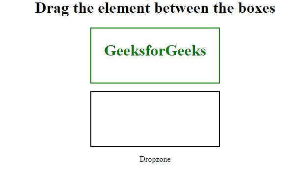

# HTML |软骨事件属性

> 原文:[https://www . geesforgeks . org/html-ondragleave-event-attribute/](https://www.geeksforgeeks.org/html-ondragleave-event-attribute/)

当可拖动元素或文本选择离开有效放置目标时，ondragleave 属性起作用。它有助于拖动元素并进入或离开拖放目标。拖放功能在 HTML 5 中非常流行。当元素可拖动时，使用 CSS 属性，并输入拖放目标。
**支持的标签:**它支持所有 HTML 碎片。

**语法:**

```html
<element ondragleave = "script">
```

**属性值:**软骨事件属性包含单值*脚本*，当软骨事件被调用时起作用。
**注意:**图片和链接默认是可拖动的。
**例:**

## 超文本标记语言

```html
<!DOCTYPE HTML>
<html>
    <head>
        <title>ondragleave event attribute</title>
        <style>
            .droptarget {
                width: 250px;
                height: 100px;
                margin: 15px;
                padding: 5px;
                border: 2px solid black;
                color:Green;
            }
        </style>
        <script>

            /* Function to start drag contenr */
            function dragStart(event) {
                event.dataTransfer.setData("Text", event.target.id);
            }

            /* Function to dragenter event */
            function dragEnter(event) {
                if ( event.target.className == "droptarget" ) {
                    event.target.style.border = "2px solid green";
                    document.getElementById("demo").innerHTML =
                                "Dropzone";
                }
            }

            /* Function to dragleave event */
            function dragLeave(event) {
                if ( event.target.className == "droptarget" ) {
                    event.target.style.border = "";
                    document.getElementById("demo").innerHTML =
                            "Out of Dropzone";
                }
            }

            /* Function to allow drop content */
            function allowDrop(event) {
                event.preventDefault();
            }

            /* Function to drop content */
            function drop(event) {
                event.preventDefault();
                var data = event.dataTransfer.getData("Text");
                event.target.appendChild(
                    document.getElementById(data));
            }
        </script>
    </head>

    <body>
        <center>
        <h1>
            Drag the element between the boxes
        </h1>

        <!-- Drag and drop event starts with
        ondragleave events -->
        <div class = "droptarget" ondrop = "drop(event)"
            ondragenter = "dragEnter(event)"
            ondragleave = "dragLeave(event)"
            ondragover = "allowDrop(event)">

            <h1 ondragstart = "dragStart(event)"
            draggable = "true" id = "dragtarget">
                GeeksforGeeks
            </h1>

        </div>

        <div class = "droptarget"
            ondragenter = "dragEnter(event)"
            ondragleave = "dragLeave(event)"
            ondrop = "drop(event)"
            ondragover = "allowDrop(event)">
        </div>
        <!-- Drag and drop events ends -->

        <p style="clear:both;"></p>

        <p id="demo"></p>

        </center>
    </body>
</html>                   
```

**输出:**



**支持的浏览器:***软骨下事件属性*支持的浏览器如下:

*   谷歌 Chrome 4.0
*   Internet Explorer 9.0
*   Mozilla Firefox 3.5
*   Safari 6.0
*   Opera 12.0