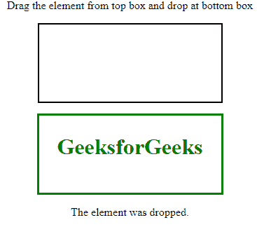

# HTML | ondragover 事件属性

> 原文:[https://www . geesforgeks . org/html-ondragover-event-attribute/](https://www.geeksforgeeks.org/html-ondragover-event-attribute/)

如果将可拖动的元素或文本拖动到有效的放置目标，将触发 ondragover 事件属性。要拖动元素，请将该元素扭曲并拖动到拖动点。这里我们将使用全局 HTML 5 可拖动属性。不能删除数据和元素。若要允许删除，必须调用 event.preventDefault()方法。它在 HTML 5 中是新的，不支持以下版本的 HTML。

**注意:**默认情况下图像和链接是可拖动的。
**属性:**

*   **可拖动目标上的事件触发器:**
    *   **ondragstart:** 当用户开始拖动元素时触发。
    *   **ondrag:** 拖动元素时触发。
    *   **ondragend:** 当用户不再拖动元素时触发。
*   **掉落目标上的事件触发器:**
    *   **ondragenter:** 当被拖动的元素进入放置目标时会触发。
    *   **ondragover:** 当拖动的元素在放置目标上时，这将触发。
    *   **软骨上:**当被拖动的元素离开放置目标时，这将触发。
    *   **ondrop:** 当拖动的元素落在放置目标上时，这将触发。

**语法:**

```html
<element ondragover="script">
```

**属性值:**包含单值**脚本**，该脚本保存在一个事件上运行的脚本。

**示例:**

```html
<!DOCTYPE HTML>
<html>

<head>
    <title>HTML ondragover event attribute</title>

    <style>
        .box {
            width: 250px;
            height: 100px;
            margin: 15px;
            padding: 5px;
            border: 2px solid black;
            color: Green;
        }
    </style>

    <script>

        /* Function of start drag contenr */
        function dragStart(event) {
            event.dataTransfer.setData("Text", event.target.id);
        }

        /* Function of allow drop content */
        function allowDrop(event) {
            event.preventDefault();
            document.getElementById("demo").innerHTML = 
                        "The element is OVER the droptarget.";
            event.target.style.border = "3px solid green";
        }

        /* Function of drop content */
        function drop(event) {
            event.preventDefault();
            var data = event.dataTransfer.getData("Text");

            event.target.appendChild(
                document.getElementById(data));

            document.getElementById("demo").innerHTML = 
                                "The element was dropped.";
        }
    </script>
</head>

<body>
    <center>
        <p>
            Drag the element from top box
            and drop at bottom box
        </p>

        <div class="box">
            <h1 ondragstart="dragStart(event)"
                    draggable="true" id="dragtarget"> 
                GeeksforGeeks 
            </h1>
        </div>

        <div class="box" ondrop="drop(event)"
                        ondragover="allowDrop(event)">
        </div>

        <p style="clear:both;"></p>

        <p id="demo"></p>
    </center>
</body>

</html>   
```

**输出:**

*   **拖动元素前:**
    
*   **掉落元素后:**
    

**支持的浏览器:**ondragover 事件属性支持的浏览器如下:

*   谷歌 Chrome 4.0
*   互联网浏览器/边缘 9.0
*   Firefox 3.5
*   Opera 12.0
*   Safari 6.0