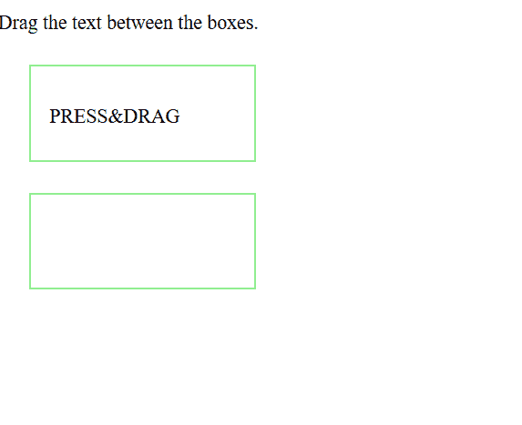
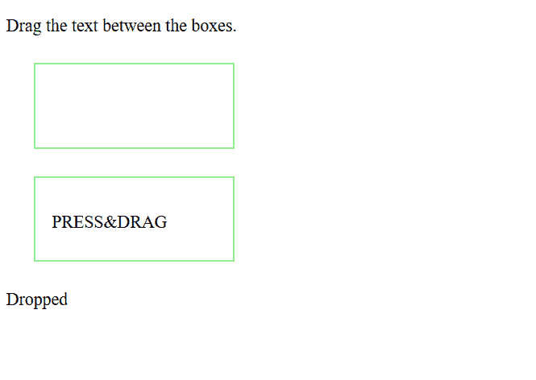

# HTML | ondragstart 事件属性

> 原文:[https://www . geesforgeks . org/html-ondragstart-event-attribute/](https://www.geeksforgeeks.org/html-ondragstart-event-attribute/)

当用户想要拖动文本或元素时，使用 HTML strong ondragstart 事件属性。简单来说，就是我们按下想要的文本，然后**拖动**和**将它们放到不同的位置。**

**语法:**

```html
ondragstart="script" 
```

**拖拽& DROP 过程包括很多操作:**

1.  用于可拖动目标的操作:
    *   **ondrag-** 在拖动元素时使用
    *   **on drag start–**当用户开始拖动元素时使用
    *   **on dragend–**当用户完成拖动元素时使用
2.  用于放置目标的操作:
    *   **ondrop:** 当拖动的元素放在放置目标上时使用
    *   **ondragover:** 当拖动的元素在放置目标上时使用
    *   **软骨层:**当被拖动的元素离开放置目标时使用
    *   **ondragenter:** 当被拖动元素进入放置目标时使用

**示例-1:** 元素拖拽掉落时返回。

```html
<!DOCTYPE HTML>
<html>

<head>
    <style>
        .droptarget {
            float: CENTRE;
            width: 150px;
            height: 45px;
            margin: 25px;
            padding: 15px;
            border: 2px solid LIGHTGREEN;
        }
    </style>
</head>

<body>

    <p>Drag the text between the boxes.</p>

    <div class="droptarget" 
         ondrop="drop(event)" 
         ondragover="allowDrop(event)">

        <!-- ondragstart script -->
        <p ondragstart="dragStart(event)" 
           ondrag="dragging(event)" 
           draggable="true" 
           id="dragtarget">
          PRESS & DRAG
      </p>
    </div>

    <div class="droptarget"
         ondrop="drop(event)"
         ondragover="allowDrop(event)">
  </div>

    <p id="demo"></p>

    <script>
        function dragStart(event) {

            event.dataTransfer.setData(
              "Text", event.target.id);
        }

        function dragging(event) {

            document.getElementById(
              "demo").innerHTML = "Dragging";
        }

        function allowDrop(event) {
            event.preventDefault();
        }

        function drop(event) {
            event.preventDefault();
            var data = 
               event.dataTransfer.getData("Text");

            event.target.appendChild(
              document.getElementById(data));

            document.getElementById(
              "demo").innerHTML = 
              "Dropped";
        }
    </script>

</body>

</html>
```

**输出:**

**拖拽前:**


**下降后:**


**支持的浏览器:**

*   Chrome 4.0
*   Firefox 3.5
*   Safari 6.0
*   Opera 12.0
*   Internet Explorer 9.0