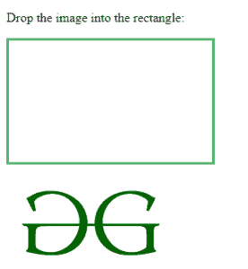
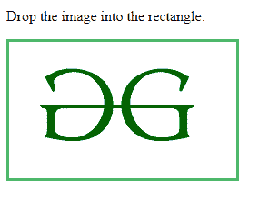

# HTML | ondrop 事件属性

> 原文:[https://www.geeksforgeeks.org/html-ondrop-event-attribute/](https://www.geeksforgeeks.org/html-ondrop-event-attribute/)

ondrop 事件属性用于将元素或文本拖放到有效的可拖放位置或目标。拖放是 HTML 5 的常见功能。
**注意:**默认情况下，图片和链接是可拖动的。
有不同的事件被使用，并且发生在 ondrop 事件之前。

*   事件发生在可拖动的目标上
*   放置目标上发生的事件:

**支持的标签:**支持所有 HTML 标签。

**事件发生在可拖动目标上:**有三个事件用于从源位置拖动元素。

<figure class="table">

| event | functionality |
| --- | --- |
| **在拖动开始时** | This event is used when the user starts dragging an element. |
| **[Ondra case]** | The Ondra event is used to drag elements. |
| **不可抗力** | This event is used to complete the dragging of an element. |

</figure>

**目标掉落时发生的事件:**用于掉落元素的事件列表如下:

<figure class="table">

| 事件 | 功能 |
| --- | --- |
| **反应物** | 此事件用于拖动元素并进入有效的放置目标。 |
| **波浪；** | 当被拖动的元素在放置位置上时，使用此事件。 |
| **软骨上** | 当被拖动的元素离开放置目标时，会发生此事件。 |
| **护套** | 当拖动的元素放在放置目标上时，会发生此事件。 |

</figure>

**例:**

## 超文本标记语言

```html
<!DOCTYPE HTML>
<html>
    <head>
        <title>
            HTML ondrop Event Attribute
        </title>

        <style>

            /* CSS property to create box */
            #geeks {
                width: 220px;
                height: 120px;
                padding: 15px;
                border: 3px solid #4cb96b;
            }
        </style>

        <script>

            /* script to allow drop of element */
            function allowDrop(gg) {
                gg.preventDefault();
            }

            /* script to drag an element */
            function drag(gg) {
                gg.dataTransfer.setData("text", gg.target.id);
            }

            /* script to drop an element */
            function drop(gg) {
                gg.preventDefault();
                var data = gg.dataTransfer.getData("text");
                gg.target.appendChild(document.getElementById(data));
            }
        </script>
    </head>

    <body>

<p>Drop the image into the rectangle:</p>

        <!-- ondrop event call here -->
        <div id = "geeks" ondrop = "drop(event)"
            ondragover = "allowDrop(event)">
        </div><br>

        

    </body>
</html>                                  
```

**输出:**
**拖动元素前:**



**拖放元素后:**



**支持的浏览器:***HTML on drop 事件属性*支持的浏览器如下:

*   谷歌 Chrome 4.0
*   Internet Explorer 9.0
*   Firefox 3.5
*   Safari 6.0
*   Opera 12.0