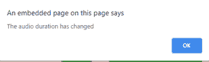
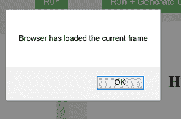

# HTML ondurationchange 属性

> 原文:[https://www . geesforgeks . org/html-ondurationchange-attribute/](https://www.geeksforgeeks.org/html-ondurationchange-attribute/)

**HTML ondurationchange 属性**是音频/视频时长改变时发生的事件属性。加载时，音频/视频的持续时间从“NaN”变为音频/视频的实际持续时间。

**语法:**

```html
<element ondurationchange="myScript">

```

**属性值:**该属性包含一个单值脚本，在 **ondurationchange** 事件属性调用时工作。该属性由 [**<音频>**](https://www.geeksforgeeks.org/html5-audio/) 和 [**<视频>**](https://www.geeksforgeeks.org/html5-video/) 标签支持。

以下示例说明了 HTML 中的 **ondurationchange** 属性:

**例 1:**

## 超文本标记语言

```html
<!DOCTYPE html> 
<html> 

<head> 
    <title> 
        HTML ondurationchange Attribute
    </title> 
</head> 

<body> 
    <center> 
        <h1 style="color:green">GeeksforGeeks</h1> 
        <h2>HTML ondurationchange Attribute</h2> 
        <audio controls ondurationchange="GFGfun()"> 
        <source src= 
"https://media.geeksforgeeks.org/wp-content/uploads/20190625153922/frog.mp3"
        type="audio/mpeg">
        </audio> 
        <script> 
            function GFGfun() { 
                alert("The audio duration has changed"); 
            } 
        </script> 
    </center> 
</body> 

</html> 
```

**输出**


**之后:**



**例 2:**

## 超文本标记语言

```html
<!DOCTYPE html>
<html>
    <head>
        <title>
            HTML ondurationchange Attribute
        </title>
    </head>

    <body>
        <center>
            <h1 style="color: green;">GeeksforGeeks</h1>
            <h2>HTML ondurationchange Attribute</h2>

            <video width="400" height="200" controls ondurationchange="GFGfun()">
                <source src=
"https://media.geeksforgeeks.org/wp-content/uploads/20190616234019/Canvas.move_.mp4" 
                        type="video/mp4" />
                <source src=
"https://media.geeksforgeeks.org/wp-content/uploads/20190616234019/Canvas.move_.ogg"
                        type="video/ogg" />
            </video>
        </center>

        <script>
            function GFGfun() {
                alert("The video duration has changed");
            }
        </script>
    </body>
</html>
```

输出


**之后:**

