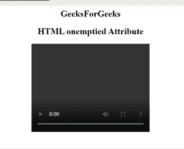
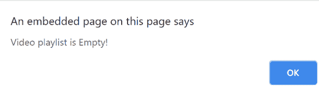

# HTML 空属性

> 原文:[https://www.geeksforgeeks.org/html-onemptied-attribute/](https://www.geeksforgeeks.org/html-onemptied-attribute/)

HTML*one mpted*属性用于在媒体遇到致命错误或媒体文件不可用或媒体播放列表为空时触发事件。

**支持的标签:**

*   **<音频>**
*   **<视频>**

**语法:**

```html
<element onemptied="scriptFunction()"> 
```

**属性值:**该属性包含单值脚本，当媒体
为空时，使用*空出的*属性。该视频或音频文件受<音频>和<视频>标签支持。

**例:**

## 超文本标记语言

```html
<!DOCTYPE html>
<html>

<body>
    <center>
        <h1>GeeksForGeeks</h1>

        <h2>HTML onemptied attribute</h2>
    </center>

    <video width="320" height="240"
        controls onemptied="onEmptied()">
        <source src="videoFile.mp4" type="video/mp4">
    </video>

    <script>
        function onEmptied() {
            alert(" Video playlist is empty!");
        }
    </script>
</body>

</html>
```

**输出:**

*   **播放列表为空前:**



*   **播放列表为空后:**



**支持的浏览器:**HTML*一个提示的*属性支持的浏览器如下:

*   谷歌 Chrome 20.0
*   Firefox 25.0
*   Safari 6.0
*   Opera 15.0