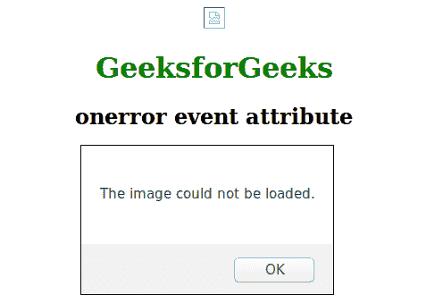

# HTML | one error 事件属性

> 原文:[https://www.geeksforgeeks.org/html-onerror-event-attribute/](https://www.geeksforgeeks.org/html-onerror-event-attribute/)

当加载外部文件时出现错误时，此属性有效。外部文件可能包含文档文件或图像文件。
**支持的标签**

*   **<输入 type="image" >**
*   **、<物体>**
*   **、<链接>**
*   **、<脚本>**

**语法:**

```html
<element onerror = "script">
```

**属性值:**该属性包含单值脚本，在一个错误事件属性调用时工作。该属性由< img >、<输入 type="image" >、<对象>、<链接>、<脚本>标签支持。
**例:**

## 超文本标记语言

```html
<!DOCTYPE html>
<html>
    <head>
        <title>onerror event attribute</title>
        <style>
            body {
                text-align:center;
            }
            h1 {
                color:green;
            }
        </style>
    </head>
    <body>
        
        <h1>GeeksforGeeks</h1>
        <h2>onerror event attribute</h2>
        <script>
        function myFunction() {
            alert("The image could not be loaded.");
        }
        </script>
    </body>
</html>                   
```

**输出:**



**支持的浏览器:**一个浏览器属性支持的浏览器如下:

*   铬
*   微软公司出品的 web 浏览器
*   火狐浏览器
*   旅行队
*   歌剧