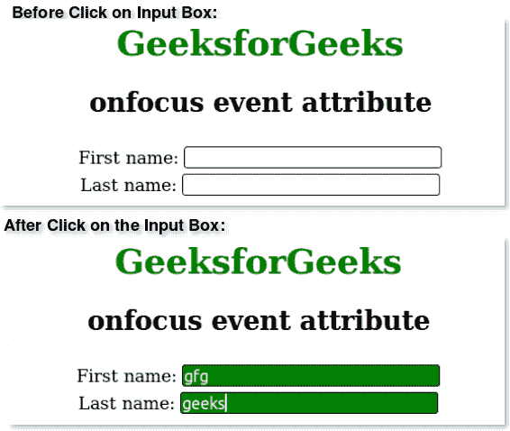

# HTML |聚焦事件属性

> 原文:[https://www.geeksforgeeks.org/html-onfocus-event-attribute/](https://www.geeksforgeeks.org/html-onfocus-event-attribute/)

当元素聚焦时，onfocus 属性起作用。该事件属性多用于<input>、<select>、元素。除、、、、、、、、</select>

*   **T2>基地**
*   **<【bdo】>**
*   **<【br】>**
*   **<头像>**
*   **< html >**
*   **< iframe >**
*   **< 当 >**
*   **<停止>**
*   **<剧本>**
*   **<风格>**
*   **<称号>**

**语法:**

```html
<element onfocus = "script">
```

**属性值:**调用 onfocus 属性时运行的脚本值。
**例:**

## 超文本标记语言

```html
<!DOCTYPE html>
<html>
    <head>
        <title>onfocus attribute</title>
        <style>
            h1 {
                color:green;
            }
            body {
                text-align:center;
            }
            input {
                color:white;
                margin-top:5px;
                border:1px solid black;
                border-radius:3px;
            }
        </style>
        <script>
            function sudo(x) {
                document.getElementById(x).style.background = "green";
            }
        </script>
    </head>
    <body>
        <h1>GeeksforGeeks</h1>
        <h2>onfocus event attribute</h2>
        First name: <input type="text" id="fname"
        onfocus="sudo(this.id)"><br>
        Last name: <input type="text" id="lname"
        onfocus="sudo(this.id)">
    </body>
```

**输出:**



**支持的浏览器:**onfocus 属性支持的浏览器如下:

*   苹果 Safari
*   谷歌 Chrome
*   火狐浏览器
*   歌剧
*   微软公司出品的 web 浏览器