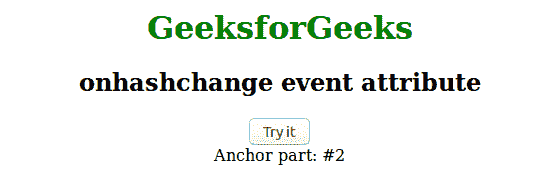

# HTML | on ashchange 事件属性

> 原文:[https://www . geesforgeks . org/html-onhashchange-event-attribute/](https://www.geeksforgeeks.org/html-onhashchange-event-attribute/)

当锚定零件发生变化时，此属性起作用。锚点部分以当前网址的“#”符号开始。
**支持的标签**

*   **<体>**

**语法:**

```html
<element onhashchange = "script">
```

**属性值:**该属性包含单值脚本，在 onhashchange 事件属性触发时运行。该属性仅与<正文>标签相关联。
**例:**

## 超文本标记语言

```html
<!DOCTYPE html>
<html>
    <head>
        <title>onhashchange event attribute</title>
        <style>
            body {
                text-align:center;
            }
            h1 {
                color:green;
            }
        </style>
    </head>
    <body>
        <h1>GeeksforGeeks</h1>
        <h2>onhashchange event attribute</h2>
        <button onclick="changePart()">Try it</button>
        <div id="gfg"></div>
        <script>
        function changePart() {
            location.hash = "2";
            var geeks = "Anchor part: " + location.hash;
            document.getElementById("gfg").innerHTML = geeks;
        }
        function myFunction() {
            alert("The anchor part has changed!");
        }
        </script>
</html>
```

**输出:**



**支持的浏览器:**事件属性*支持的浏览器如下:* 

*   铬 5.0
*   Internet Explorer 8.0
*   Firefox 3.6
*   Safari 5.0
*   歌剧 10.6