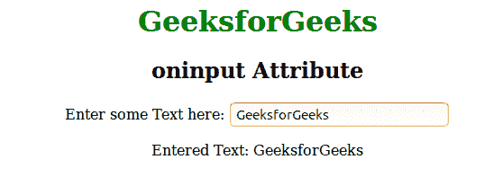

# HTML | oninput 事件属性

> 原文:[https://www.geeksforgeeks.org/html-oninput-event-attribute/](https://www.geeksforgeeks.org/html-oninput-event-attribute/)

该属性在获取用户输入值时有效。该属性主要在用户更改<input>和<textarea>元素的值时触发。该属性与 onchange 属性非常相似，但基本区别在于 oninput 事件属性在元素值改变时立即发生，而 onchange 属性在元素失去焦点时发生。另一个不同之处是 onchange 属性也适用于<select>元素。<br/> <strong>支持的标签:</strong></select></textarea>

*   **<输入 type="password" >**
*   **<输入 type="search" >**
*   **，<输入 type="text" >**
*   **< textarea >**

**语法:**

```html
<element oninput = "script">
```

**属性值:**该属性包含值*脚本*，当 oninput 事件触发时生效。很多 HTML 标签都支持这个属性:<输入类型=“密码”>、<输入类型=“搜索”、<输入类型=“文本”>和< textarea >。
**例:**

## 超文本标记语言

```html
<!DOCTYPE html>
<html>
    <head>
        <title>oninput attribute</title>
        <style>
            body {
                text-align:center;
            }
            h1 {
                color:green;
            }
        </style>
    </head>
    <body>
        <h1>GeeksforGeeks</h1>
        <h2>oninput Attribute</h2>
        Enter some Text here: <input type="text" id="GFG"
        oninput="Geeks()">
        <p id="sudo"></p>

        <script>
            function Geeks() {
                var x = document.getElementById("GFG").value;
                document.getElementById("sudo").innerHTML =
                "Entered Text: " + x;
            }
        </script>
    </body>
</html>                   
```

**输出:**



**支持的浏览器:**事件属性*支持的浏览器如下:* 

*   苹果 Safari 5.0
*   谷歌 Chrome
*   Firefox 4.0
*   歌剧
*   Internet Explorer 9.0