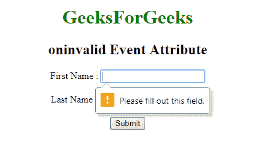

# HTML | on 无效事件属性

> 原文:[https://www . geesforgeks . org/html-on invalid-event-attribute/](https://www.geeksforgeeks.org/html-oninvalid-event-attribute/)

当输入字段值无效或为空时，oninvalid 事件属性有效。当用户单击提交按钮时，脚本运行。提交前，必须填写必填输入字段。
**支持的标签:**

*   **<输入>**

**语法:**

```html
<element oninvalid = "script">
```

**属性值:**该属性包含单值*脚本*，当调用无效属性时有效。所有 HTML 元素都支持它。
**例:**

## 超文本标记语言

```html
<!DOCTYPE html>
<html>
    <head>
        <title>oninvalid Event Attribute</title>
        <style>
            h1 {
                color:green;
            }
            body {
                text-align:center;
            }
        </style>
    </head>
    <body>
        <h1>GeeksForGeeks</h1>
        <h2>oninvalid Event Attribute</h2>
        <form action="#" method="post">
            First Name : <input type = "text" oninvalid =
            alert('Please Fill all input field!') required><br><br>
            Last Name : <input type = "text" oninvalid =
            alert('Please Fill all input field!') required><br>
            <input type="submit" value="Submit">
        </form>
    </body>
</html>                   
```

**输出:**



**支持的浏览器:**on invalid 事件属性支持的浏览器如下:

*   铬
*   Internet Explorer 10.0
*   火狐浏览器
*   歌剧