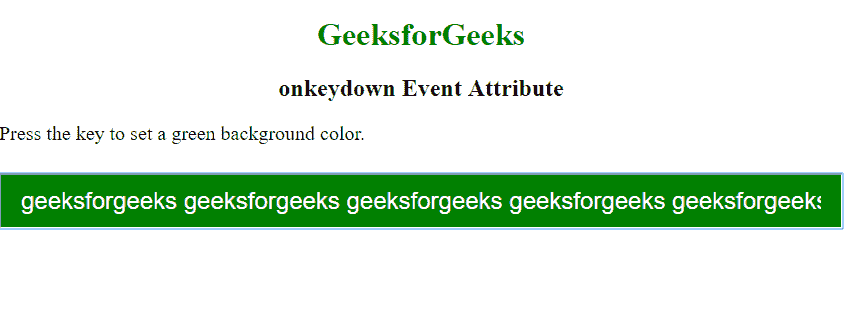
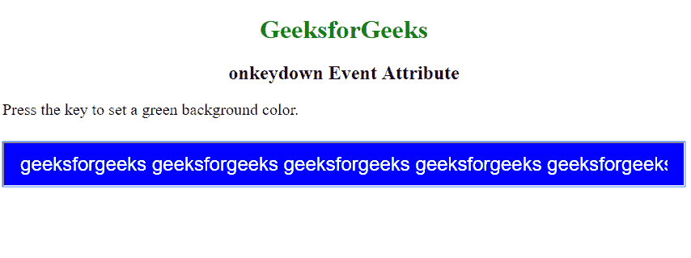

# HTML | onkeydown 事件属性

> 原文:[https://www . geesforgeks . org/html-onkeydown-event-attribute/](https://www.geeksforgeeks.org/html-onkeydown-event-attribute/)

当用户按下键盘上的任何键时，onkeydown 事件属性起作用。
**支持的标签:**支持除-

*   **T2>基地**
*   **<【bdo】>**
*   **<【br】>**
*   **<头像>**
*   **< html >**
*   **< iframe >**
*   **< 当 >**
*   **<停止>**
*   **<剧本>**
*   **<风格>**
*   **<称号>**

**语法:**

```html
<element onkeydown = "script">
```

**属性值:**该属性包含单值*脚本*，当从键盘上按下任何一个键时都有效。
**支持的标签:**除<基础>、< bdo >、< br >、< head >、< html >、< iframe >、< meta >、< param >、<脚本>、<样式>和>外，其他所有 HTML 元素都支持
**例:**

## 超文本标记语言

```html
<!DOCTYPE html>
<html>
    <head>
        <title> HTML | onkeydown Event Attribute </title>
        <style>
            h1 {
                text-align: center;
                color: green;
            }
            h2 {
                text-align: center;
            }
            input[type=text] {
                width: 100%;
                padding: 12px 20px;
                margin: 8px 0;
                box-sizing: border-box;
                font-size: 24px;
                color: white;
            }
            p {
                font-size: 20px;
            }
        </style>
    </head>
    <body>
        <h1>GeeksforGeeks<h1>
        <h2>onkeyup Event Attribute</h2>

<p>Release the key to set a green background color.</p>

        <input type="text" id="demo" onkeydown="keydownFunction()"
                onkeyup="keyupFunction()">
        <script>
            function keyupFunction() {
              document.getElementById("demo").style.backgroundColor = "blue";
            }

            function keydownFunction() {
              document.getElementById("demo").style.backgroundColor = "green";
            }
        </script>
    </body>
</html>
```

**输出:**
**按键:**



**释放钥匙:**



**支持的浏览器:**事件属性 *onkeydown* 支持的浏览器如下:

*   铬
*   微软公司出品的 web 浏览器
*   火狐浏览器
*   旅行队
*   歌剧