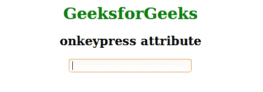
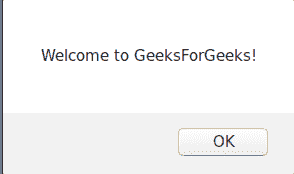

# HTML | onkeypress 属性

> 原文:[https://www.geeksforgeeks.org/html-onkeypress-attribute/](https://www.geeksforgeeks.org/html-onkeypress-attribute/)

当用户按下键盘上的某个键时，此属性会触发。此事件属性不能用于所有浏览器中的所有按键(如 ALT、CTRL、SHIFT、ESC)。
**支持的标签:所有 HTML 元素，除了:**

*   <iframe></li><li><meta/></li><li><param/></li><li><script/></li><li><style/></li><li><title/></li></ul>
<strong>语法:</strong>  
<pre>&lt;element onkeypress="script"&gt;</pre>
<strong>属性:</strong>onkeydown 属性适用于所有浏览器中的所有按键。该脚本将在 keypress 属性调用时运行。  <strong>注:</strong>与按键事件相关的事件顺序: 
<ul><li>叔叔家</li><li>基普</li><li>上基乌普</li></ul>
<strong>例:</strong>  

<h2 class="tabtitle">超文本标记语言</h2>
<pre>&lt;!DOCTYPE html&gt; &lt;html&gt;     &lt;head&gt;         &lt;title&gt;onkeypress attribute&lt;/title&gt;         &lt;style&gt;             body {                 text-align:center;             }                h1 {                 color:green;             }         &lt;/style&gt;     &lt;/head&gt;     &lt;body&gt;         &lt;h1&gt;GeeksforGeeks&lt;/h1&gt;         &lt;h2&gt;onkeypress attribute&lt;/h2&gt;         &lt;input type="text" onkeypress="GeeksForGeeks()"&gt;         &lt;script&gt;             function GeeksForGeeks() {                 alert("Welcome to GeeksForGeeks!");             }         &lt;/script&gt;     &lt;/body&gt; &lt;/html&gt;                   </pre>

<strong>输出:</strong>  在文本框中点击前: 

点击文本框后: 

<strong>支持的浏览器:</strong>onkey press 事件属性支持的浏览器如下: 
<ul><li>谷歌 Chrome</li><li>微软公司出品的 web 浏览器</li><li>火狐浏览器</li><li>歌剧</li><li>苹果 Safari</li></ul>
 
 </body></html></iframe>