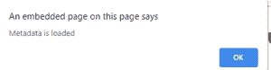

# HTML onloadedmetadata 属性

> 原文:[https://www . geesforgeks . org/html-onloadedmetadata-attribute/](https://www.geeksforgeeks.org/html-onloadedmetadata-attribute/)

**HTML onloadedmetadata 属性**是为指定的音频/视频加载元数据时发生的事件属性。

**支持的标签:**

*   **<音频>**
*   **<视频>**

**语法:**

```html
<element onloadedmetadata="myScript">
```

**属性值:**该属性包含单值脚本，在 onloadedmetadata 事件属性调用时工作。该属性由<音频>和<视频>标签支持。

**示例:**

## 超文本标记语言

```html
<!DOCTYPE html>
<html>

<head>
    <title>
        HTML onloadedmetadata Attribute
    </title>
</head>

<body>
    <center>
        <h1 style="color:green">
        GeeksforGeeks
    </h1>
        <h2>
        HTML onloadedmetadata Attribute
    </h2>
        <audio controls id="audioId">

        </audio>

        <script>
            document.getElementById(
            "audioId").addEventListener(
            "loadedmetadata", GFGFun);

            function GFGFun() {
                alert("Metadata is loaded");
            }
        </script>
    </center>
</body>

</html>
```

**输出:**

**之前:**


**之后:**



**支持的浏览器:**

*   谷歌 Chrome
*   微软公司出品的 web 浏览器
*   火狐浏览器
*   苹果 Safari
*   歌剧