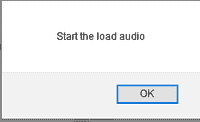

# HTML onloadstart 属性

> 原文:[https://www.geeksforgeeks.org/html-onloadstart-attribute/](https://www.geeksforgeeks.org/html-onloadstart-attribute/)

**HTML onloadstart 属性**是指定音频/视频加载过程开始时发生的事件属性。

**语法:**

```html
<element onloadstart="myScript">
```

**属性值:**该属性包含一个单值脚本，在 **onloadstart** 事件属性调用时工作。该属性由 [<音频>](https://www.geeksforgeeks.org/html5-audio/) 和 [<视频>](https://www.geeksforgeeks.org/html5-video/) 标签支持。

**示例:**

```html
<!DOCTYPE html> 
<html> 

<head> 
    <title> 
        HTML  onloadstart Attribute 
    </title> 
</head> 

<body> 
    <center> 
        <h1 style="color:green"> 
        GeeksforGeeks 
    </h1> 
        <h2>DOM onloadstart Attribute</h2> 
        <audio controls id="audId"> 
        <source src= 
"https://media.geeksforgeeks.org/wp-content/uploads/20190625153922/frog.mp3"
        type="audio/mpeg">
        </audio> 

        <script> 
            document.getElementById( 
            "audId").addEventListener( 
            "loadstart", GFGFun); 

            function GFGFun() { 
                alert("Start the load audio"); 
            } 
        </script> 
    </center> 
</body> 

</html>                    
```

**输出:**


**之后:**

