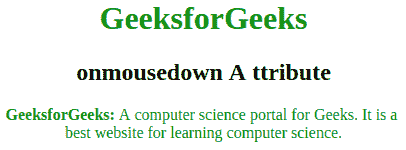

# HTML | onmousedown 属性

> 原文:[https://www.geeksforgeeks.org/html-onmousedown-attribute/](https://www.geeksforgeeks.org/html-onmousedown-attribute/)

当在元素上按下鼠标按钮，并且与 onmousedown 事件相关的事件发生顺序(对于左/鼠标按钮)
时，将触发此 onmousedown 属性

*   onmousedown
*   是 mouseup
*   onclick

**支持的标签:支持所有 HTML 元素。**

**语法:**

```html
<element onmousedown="script">
```

**属性值:**所有 HTML 元素都支持。onmousedown 属性调用时脚本事件运行。
**例:**

## 超文本标记语言

```html
<!DOCTYPE html>
<!DOCTYPE html>
<html>

<head>
    <title>onmousedown attribute</title>
    <style>
        body {
            text-align: center;
        }

        h1 {
            color: green;
        }
    </style>
</head>

<body>
    <h1>GeeksforGeeks</h1>
    <h2>onmousedown A ttribute</h2>
    <p id="gfg" onmousedown="mouseDown()"
                        onmouseup="Geeks()">
        <b>GeeksforGeeks:</b> A computer science portal
        for Geeks. It is best website for learning<br>
        computer science.
    </p>

    <script>
        function Geeks() {
            document.getElementById("gfg").style.color = "green";
        }

        function mouseDown() {
            document.getElementById("gfg").style.color = "red";
        }
    </script>
</body>

</html>                         
```

**输出:**



**支持的浏览器:**支持的浏览器 *onmousedown* 属性如下:

*   谷歌 Chrome
*   微软公司出品的 web 浏览器
*   火狐浏览器
*   歌剧
*   旅行队