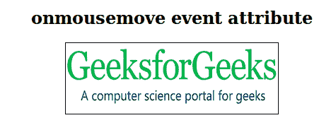
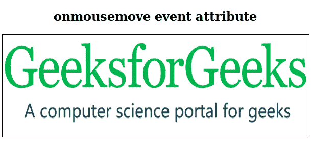

# HTML | onmousemove 事件属性

> 原文:[https://www . geesforgeks . org/html-onmousemove-event-attribute/](https://www.geeksforgeeks.org/html-onmousemove-event-attribute/)

当指针在元素上移动时，onmousemove 属性起作用。
**支持的标签:所有 HTML 元素，除了:**

*   **T2>基地**
*   **<【bdo】>**
*   **<【br】>**
*   **<头像>**
*   **< html >**
*   **< iframe >**
*   **< 当 >**
*   **<停止>**
*   **<剧本>**
*   **<风格>**
*   **<称号>**

**语法:**

```html
<element onmousemove = "script">
```

**属性值:**该属性包含单值*脚本*，调用 onmousemove 属性时有效。
**例:**

## 超文本标记语言

```html
<!DOCTYPE html>
<html>
    <head>
        <title>onmousemove event attribute</title>
    </head>
    <body>
        <center>
        <h2>onmousemove event attribute</h2>
        
        <script>
            function bigSize(val) {
                val.style.height = "200px";
                val.style.width = "600px";
            }

            function normalSize(val) {
                val.style.height = "100px";
                val.style.width = "300px";
            }
        </script>
    </body>
</html>
```

**输出:**
**前:**



**之后:**



**支持的浏览器:**onmousemove 属性支持的浏览器如下:

*   铬
*   微软公司出品的 web 浏览器
*   火狐浏览器
*   旅行队
*   歌剧