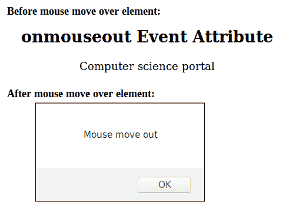

# HTML | onmouseout 事件属性

> 原文:[https://www . geesforgeks . org/html-onmouseout-event-attribute/](https://www.geeksforgeeks.org/html-onmouseout-event-attribute/)

当鼠标指针移出指定元素时， **onmouseout 事件**属性起作用。

**语法:**

```html
<element onmouseout = "script">
```

**属性值:**该属性包含单值*脚本*，当鼠标从元素中移出时生效。

**支持的标签:**除了<基础>、< bdo >、< br >、< head >、< html >、< iframe >、< meta >、< param >、<脚本>、<样式>和<标题>外，所有 HTML 元素都支持该属性

**示例:**本示例使用 onmouseout 事件在鼠标从段落元素移出时显示警告消息。

```html
<!DOCTYPE html> 
<html> 
    <head> 
        <title>
            onmouseout Event Attribute
        </title> 
        <script> 

            /* Script run when onmouseout 
                     event call */
            function geeks() { 
                alert("Mouse move out"); 
            } 
        </script> 
    </head> 

    <body style = "text-align:center"> 

        <h2>
            onmouseout Event Attribute
        </h2> 

        <!-- onmouseout event call here -->
        <p onmouseout = "geeks()">
            Computer science portal
        </p> 
    </body> 
</html>                    
```

**输出:**


**支持的浏览器:**支持的浏览器 *onmouseout 事件属性*如下:

*   谷歌 Chrome
*   微软公司出品的 web 浏览器
*   旅行队
*   火狐浏览器
*   歌剧