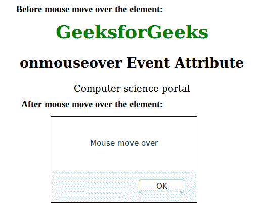

# HTML | onmouseover 事件属性

> 原文:[https://www . geesforgeks . org/html-onmouseover-event-attribute/](https://www.geeksforgeeks.org/html-onmouseover-event-attribute/)

当鼠标指针移动到指定元素上时，onmouseover 事件属性起作用。

**语法:**

```html
<element onmouseover = "script">
```

**属性值:**该属性包含单值*脚本*，当鼠标在元素上移动时生效。

**支持的标签:**除了<基础>、< bdo >、< br >、< head >、< html >、< iframe >、< meta >、< param >、<脚本>、<样式>和<标题>外，几乎所有 HTML 元素都支持该属性

**示例:**

```html
<!DOCTYPE html>
<html>
    <head>
        <title>onmouseover Event Attribute</title>
        <style>
            body {
                text-align:center;
            }
            h1 {
                color:green;
            }
        </style>
        <script type="text/javascript" >
            function geeks() {
                alert("Mouse move over");
            } 
        </script>
    </head>
    <body>
        <h1>GeeksforGeeks</h1>
        <h2>onmouseover Event Attribute</h2>
        <p onmouseover ="geeks()">Computer science portal</p>
    </body>
</html>                    
```

**输出:**


**支持的浏览器:**onmouseover 事件属性支持的浏览器如下:

*   谷歌 Chrome
*   微软公司出品的 web 浏览器
*   旅行队
*   火狐浏览器
*   歌剧