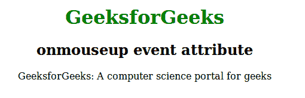
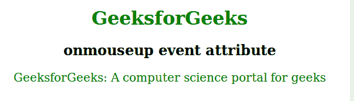

# HTML | onmouseup 事件属性

> 原文:[https://www . geesforgeks . org/html-onmouseup-event-attribute/](https://www.geeksforgeeks.org/html-onmouseup-event-attribute/)

当鼠标按钮在元素上释放时，此属性会激发。事件发生的顺序与 onmouseup 事件相关。

*   onmousedown
*   是 mouseup
*   onclick

**支持的标签:所有 HTML 元素，除了:**

*   **T2>基地**
*   **<【bdo】>**
*   **<【br】>**
*   **<头像>**
*   **< html >**
*   **< iframe >**
*   **< 当 >**
*   **<停止>**
*   **<剧本>**
*   **<风格>**
*   **<称号>**

**语法:**

```html
<element onmouseup = "script">
```

**属性值:**该属性包含单值*脚本*，调用 onmouseup 属性时有效。
**例:**

## 超文本标记语言

```html
<!DOCTYPE html>
<html>
    <head>
        <title>onmouseup event attribute</title>
        <style>
            h1 {
                color:green;
            }
            body {
                text-align:center;
            }
        </style>
    </head>
    <body>
        <center>
        <h1>GeeksforGeeks</h1>
        <h2>onmouseup event attribute</h2>
        <p id="gfg" onmouseup="mouseUp()">
        GeeksforGeeks: ! computer science portal for geeks
        </p>

        <script>
            function mouseUp() {
                document.getElementById("gfg").style.color = "green";
                document.getElementById("gfg").style.fontSize = "20px";
            }
        </script>
    </body>
</html>
```

**输出:**
**前:**



**之后:**



**支持的浏览器:**T2 onmouseup 属性支持的浏览器如下:

*   铬
*   微软公司出品的 web 浏览器
*   火狐浏览器
*   旅行队
*   歌剧