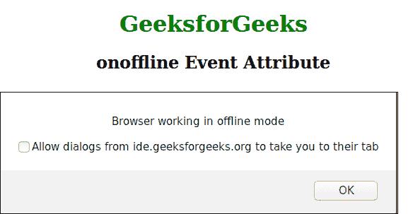

# HTML |在线事件属性

> 原文:[https://www . geesforgeks . org/html-onoffline-event-attribute/](https://www.geeksforgeeks.org/html-onoffline-event-attribute/)

当浏览器在脱机模式下工作时，onoffline 事件属性起作用。仅由标签支持。它与在线事件属性*相反。*

**支持的标签**

*   **<体>**

**语法:**

```html
<element onoffline = "script">
```

**属性值:**调用 onoffline 属性时运行脚本事件。

**示例:**

## 超文本标记语言

```html
<!DOCTYPE html>
<html>
    <head>
        <title>onoffline event attribute</title>
        <style>
            h1 {
                color:green;
            }
            body {
                text-align:center;
            }
        </style>
    </head>
    <body onoffline = "gfg()">
        <h1>GeeksforGeeks</h1>
        <h2>onoffline Event Attribute</h2>
        <script>
            function gfg() {
                alert ("Browser working in offline mode");
            }
        </script>
    </body>
</html>                   
```

**输出:**



**支持的浏览器:**T2 在线事件属性支持的浏览器如下:

*   Firefox 3.0
*   Internet Explorer 8.0