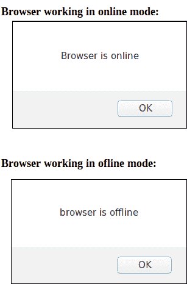

# HTML | ononline 事件属性

> 原文:[https://www . geesforgeks . org/html-on online-event-attribute/](https://www.geeksforgeeks.org/html-ononline-event-attribute/)

当浏览器开始在联机模式下工作时，ononline 事件属性起作用。它与 onoffline 事件属性相反。
**支持的标签**

*   **<体>**

**语法**

```html
<element ononline = "script">
```

**属性值:**该事件属性包含单值*脚本*，在浏览器在线模式下工作时有效。
**例:**

## 超文本标记语言

```html
<!DOCTYPE HTML>
<html>
    <head>
        <title>
            ononline Event Attribute
        </title>

        <script>
            function onfunction() {
                alert("Browser is online");
            }
            function offunction() {
                alert("browser is offline");
            }
        </script>
    </head>

    <!-- ononline event used here -->
    <body ononline = "onfunction()"
        onoffline = "offunction()">
    </body>
</html>                           
```

**输出:**



**支持的浏览器:**此事件仅火狐 3.0 支持。没有其他浏览器支持此事件。