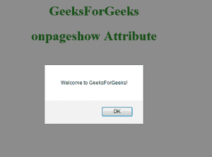

# HTML | onpageshow 事件属性

> 原文:[https://www . geesforgeks . org/html-onpageshow-event-attribute/](https://www.geeksforgeeks.org/html-onpageshow-event-attribute/)

当用户导航到网站时，会发生此事件。此事件与 onload 事件非常相似，但它发生在 onload 事件之后。每次加载页面时都会发生此事件，而从缓存加载页面时不会发生 onload 事件。
**支持的标签:**

*   **<体>**

**语法:**

```html
<element onpageshow = "script"> 
```

该事件包含单属性*脚本*。该脚本将在 onpageshow 事件上运行。此事件与 in body 标记一起使用。
**例:**

## 超文本标记语言

```html
<!DOCTYPE html>
<html>
    <head>
        <title>onpageshow event</title>
    </head>
    <body onpageshow="Geeks()">
        <h1 style="color:green;text-align:center;">GeeksForGeeks</h1>
        <script>
            function Geeks() {
                alert("Welcome to GeeksForGeeks!");
            }
        </script>
    </body>
</html>                   
```

**输出:**



**支持的浏览器:**onpageshow 事件属性支持的浏览器如下:

*   Apple Safari 5.0 及以上版本
*   谷歌 Chrome
*   火狐浏览器
*   歌剧
*   Internet Explorer 11.0 及以上版本