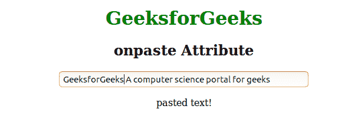

# HTML | onpaste 事件属性

> 原文:[https://www.geeksforgeeks.org/html-onpaste-event-attribute/](https://www.geeksforgeeks.org/html-onpaste-event-attribute/)

onpaste 属性在某些内容粘贴到元素中时有效。所有 HTML 元素都支持此事件属性。多用于<input>元素。
有三种方法可以将内容粘贴到下面列出的 HTML 元素中:

*   使用 CTRL + V 键
*   从浏览器的编辑菜单中选择“粘贴”。
*   从右键菜单中选择“粘贴”命令

**支持的标签:**支持所有 HTML 元素。

**语法:**

```html
<element onpaste = "script">
```

**属性值:**调用 onpaste 属性时脚本事件运行。
**例:**

## 超文本标记语言

```html
<!DOCTYPE html>
<html>
    <head>
        <title>onpaste attribute</title>
        <style>
            body {
                text-align:center;
            }
            h1 {
                color:green;
            }
        </style>
    </head>
    <body>
        <h1>GeeksforGeeks</h1>
        <h2>onpaste Attribute</h2>
        <input type="text" onpaste="Geeks()"
        value="A computer science portal for geeks" size="40">
        <p id="sudo"></p>

        <script>
            function Geeks() {
                document.getElementById("sudo").innerHTML = "pasted text!";
            }
        </script>
    </body>
</html>                   
```

**输出:**



**支持的浏览器:**按一下属性*支持的浏览器如下:* 

*   苹果 Safari
*   谷歌 Chrome
*   火狐浏览器
*   歌剧
*   微软公司出品的 web 浏览器