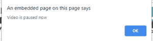
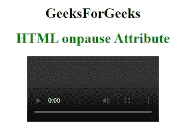

# HTML onpause 属性

> 原文:[https://www.geeksforgeeks.org/html-onpause-attribute/](https://www.geeksforgeeks.org/html-onpause-attribute/)

**HTML onpause 属性**是一个事件属性，当用户暂停音频时，它将自动暂停或停止。

**用法**:此属性用于<音频>和<视频>标签。

**属性值:**该属性包含单值脚本，在事件属性调用时工作。该属性由<音频>和<视频>标签支持。

**语法:**

```html
<element onpause="myScript">
```

**示例:**

## 超文本标记语言

```html
<!DOCTYPE html>
<html>

<head>
    <title>
        HTML onpause Attribute
    </title>
</head>

<body>
     <center>
    <h1>
        GeeksForGeeks
    </h1>
    <h1 style="color:green">
    HTML onpause Attribute
</h1>
 <video controls id="geeks">
            <source src="Geekfun.mp4"
                    type="video/mp4">
        </video>

    <script>
        var aud =
            document.getElementById("geeks");
        aud.onpause = function() {
            alert("video is paused now");
        };
    </script>
</body>

</html>
```

**输出:**

 

**支持的浏览器:**

*   **谷歌铬**
*   **firefox**
*   **Safari**
*   **歌剧**
*   **互联网浏览器**