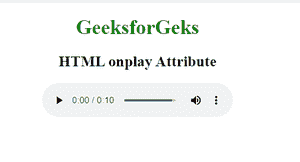
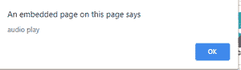
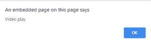

# HTML onplay 属性

> 原文:[https://www.geeksforgeeks.org/html-onplay-attribute/](https://www.geeksforgeeks.org/html-onplay-attribute/)

HTML strong onplay 属性是在播放音频/视频时出现的更均匀的属性。音频/视频可以由用户播放，也可以通过编程方式播放。

**支持的标签:**

*   **<音频>**
*   **<视频>**

**语法:**

```html
<element onplay="myScript">
```

**属性值:**该属性包含单值脚本，在 onplay 事件属性调用时工作。该属性由<音频>和<视频>标签支持。

**例 1:**

## 超文本标记语言

```html
<!DOCTYPE html>
<html>
    <head>
        <title>
            HTML onplay Attribute
        </title>
    </head>

    <body>
        <center>
            <h1 style="color: green;">
                GeeksforGeks
            </h1>
            <h2>HTML onplay Attribute</h2>

            <audio controls id="audID"
                   onplay="GFGfun()">
                <source src=
"https://media.geeksforgeeks.org/wp-content/uploads/20190625153922/frog.mp3"
                        type="audio/mpeg" />
            </audio>

            <script>
                function GFGfun() {
                    alert("audio play");
                }
            </script>
        </center>
    </body>
</html>
```

**输出:**



**点击播放按钮后:**



例 2:

## 超文本标记语言

```html
<!DOCTYPE html>
<html>
    <head>
        <title>
            HTML onplay Attribute
        </title>
    </head>

    <body>
        <center>
            <h1 style="color: green;">
                GeeksforGeks
            </h1>
            <h2>HTML onplay Attribute</h2>

            <video controls id="vidID"
                   onplay="GFGfun()"
                   width="320"
                   height="240">
                <source src=
"https://media.geeksforgeeks.org/wp-content/uploads/20190401140735/g4g2.mp4"
                        type="video/mp4" />
            </video>

            <script>
                function GFGfun() {
                    alert("Video play");
                }
            </script>
        </center>
    </body>
</html>
```

**输出:**


**之后:**



**支持的浏览器:**

*   谷歌 Chrome
*   微软公司出品的 web 浏览器
*   火狐浏览器
*   苹果 Safari
*   歌剧