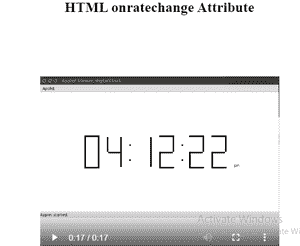

# HTML 成批更改属性

> 原文:[https://www.geeksforgeeks.org/html-onratechange-attribute/](https://www.geeksforgeeks.org/html-onratechange-attribute/)

HTML**on ate change 属性**是音频/视频播放速度改变时发生的事件属性。playbackRate 属性用于设置或返回音频/视频的当前播放速度。

**语法:**

```html
<element onratechange="myScript">
```

**属性值:**该属性包含单值脚本，该脚本在对已更改的事件属性调用时工作。该属性由<音频>和<视频>标签支持。

**示例:**

```html
<!DOCTYPE html> 
<html> 

<head> 
    <title> 
        HTML onratechange Attribute 
    </title> 
</head> 

<body> 
    <center> 
        <h1 style="color:green"> 
        GeeksforGeks 
    </h1> 
        <h2>HTML onratechange Attribute</h2> 

        <video id="vidID"
            width="400" height="400"
            autoplay controls> 
            <source src= 
"https://media.geeksforgeeks.org/wp-content/uploads/20190401140735/g4g2.mp4"
                    type="video/mp4"> 
        </video> 
        <br> 

        <button onclick="speed()" type="button"> 
        Slow motion 
    </button> 

        <script> 
            // Get the video element with id="myVideo" 
            var x = document.getElementById("vidID"); 

            function speed() { 
                x.playbackRate = 0.5; 
            } 

            x.addEventListener("ratechange", GFGfun); 

            function GFGfun() { 
                alert("Playing speed changed"); 
            } 
        </script> 
    </center> 
</body> 

</html>
```

**输出:**




**支持的浏览器:**

*   谷歌 Chrome
*   微软公司出品的 web 浏览器
*   火狐浏览器
*   苹果 Safari
*   歌剧