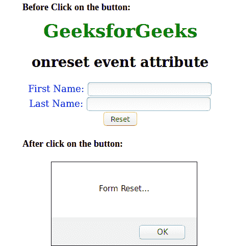

# HTML | on set 事件属性

> 原文:[https://www.geeksforgeeks.org/html-onreset-event-attribute/](https://www.geeksforgeeks.org/html-onreset-event-attribute/)

重置表单时，会触发 HTML 中的 onreset 事件属性。该属性适用于表单标签。
**支持的标签:**

*   **<形态>**

**语法:**

```html
<form onreset = "script">
```

**属性值:**该属性包含单值*脚本*，该脚本在设置事件调用时工作。
**例:**

## 超文本标记语言

```html
<!DOCTYPE html >
<html>
    <head>
        <title>onreset event attribute</title>
        <style>
            body {
                text-align:center;
            }
            h1 {
                color:green;
            }
        </style>
        <script>
            function Geeks() {
                alert("Form Reset...") ;
            }
        </script >
    </head>
    <body>
        <h1>GeeksforGeeks</h1>
        <h2>onreset event attribute</h2>
        <form onreset="Geeks()" style="color:blue";>
            First Name: <input type="text"></br>
            Last Name: <input type="text"></br>
            <input type="reset">
        </form>
    </body>
</html>                         
```

**输出:**



**支持的浏览器:**设置事件属性时*支持的浏览器如下:* 

*   谷歌 Chrome
*   微软公司出品的 web 浏览器
*   歌剧
*   火狐浏览器
*   旅行队