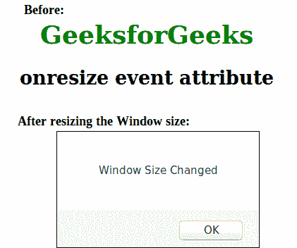

# HTML | onresize 事件属性

> 原文:[https://www . geesforgeks . org/html-on resize-event-attribute/](https://www.geeksforgeeks.org/html-onresize-event-attribute/)

每次调整浏览器窗口大小时，onresize 事件属性都会被触发。
**支持的标签:**

*   **<体>**

**语法:**

```html
<element onresize = "script">
```

**属性值:**该属性包含单个值*脚本*，在请求事件调用时有效。
**注意:**这个属性和身体标签配合使用。
**例:**

## 超文本标记语言

```html
<!DOCTYPE html >
<html>
    <head>
        <title>onresize event attribute</title>
        <style>
            body {
                text-align:center;
            }
            h1 {
                color:green;
            }
        </style>
        <script>
            function Geeks() {
                alert("Window Size Changed") ;
            }
        </script >
    </head>
    <body onresize = "Geeks()">
        <h1>GeeksforGeeks</h1>
        <h2>onresize event attribute</h2>
    </body>
</html>                                   
```

**输出:**



**支持的浏览器:**onresize 事件属性支持的浏览器如下:

*   谷歌 Chrome
*   微软公司出品的 web 浏览器
*   歌剧
*   火狐浏览器
*   旅行队