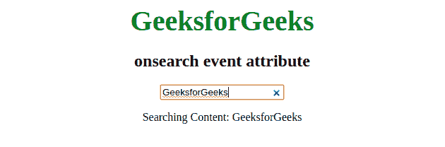

# HTML | onsearch 事件属性

> 原文:[https://www . geesforgeks . org/html-on search-event-attribute/](https://www.geeksforgeeks.org/html-onsearch-event-attribute/)

当用户按下*回车*按钮或点击 *x* 按钮时，该 onsearch 属性起作用。该事件与<输入>元素一起工作。
**支持的标签:**

*   **<输入 type="search" >**

**语法:**

```html
<element onsearch="script">
```

**属性:**该事件包含单属性*脚本*，该脚本包含事件调用时要运行的脚本。
**例:**

## 超文本标记语言

```html
<!DOCTYPE html>
<html>
    <head>
        <title>onsearch event</title>
        <style>
            .gfg {
                font-size:40px;
                color:green;
                font-weight:bold;
            }
            body {
                text-align:center;
            }
        </style>
    </head>
    <body>

    <div class = "gfg">GeeksforGeeks</div>
    <h2>onsearch event attribute</h2>
    <input type="search" id="geeks" onsearch="geeksforgeeks()">

    <p id="geek"></p>

    <script>
        function geeksforgeeks() {
            var x = document.getElementById("geeks");
            document.getElementById("geek").innerHTML =
                   "Searching Content: " + x.value;
        }
    </script>       
    </body>
</html>
```

**输出:**



**支持的浏览器:**搜索事件属性*支持的浏览器如下:* 

*   苹果 Safari
*   谷歌 Chrome
*   Opera 15.0