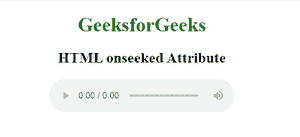

# HTML onseeked 属性

> 原文:[https://www.geeksforgeeks.org/html-onseeked-attribute/](https://www.geeksforgeeks.org/html-onseeked-attribute/)

**HTML onseeked 属性**是当用户完成跳过媒体到新位置时发生的事件属性。

**适用:**

*   **<音频>**
*   **<视频>**

**语法:**

```html
<element onseeked="Script">
```

**属性值:**该属性包含单值脚本，该脚本在启动事件属性调用时工作。该属性由<音频>和<视频>标签支持。

**示例:**

## 超文本标记语言

```html
<!DOCTYPE html>
<html>

<head>
    <title>
        HTML onseeked Attribute
    </title>
</head>

<body>
    <center>
        <h1 style="color:green">GeeksforGeeks</h1>
        <h2>HTML onseeked Attribute</h2>

            <audio controls id="audio">
            <source src="beep.mp3" type="audio/mpeg">
        </audio>
    </center>
    <script>
        document.getElementById(
        "audio").addEventListener("seeked", GFGfun);

        function GFGfun() {
            alert("Media Skipped");
        }
    </script>

</body>

</html>
```

**输出:**

 

**支持的浏览器:**

*   谷歌 Chrome
*   微软公司出品的 web 浏览器
*   火狐浏览器
*   苹果 Safari
*   歌剧