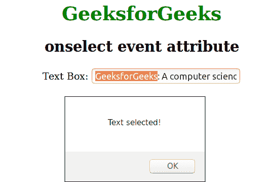

# HTML | onselect 事件属性

> 原文:[https://www . geesforgeks . org/html-on sele-event-attribute/](https://www.geeksforgeeks.org/html-onselect-event-attribute/)

当在元素中选择了一些文本时，onselect 事件属性起作用。它是事件属性的一部分。有很多 HTML 元素支持，如<input type="“file”">、<input type="“password”">、<input type="“text”">、<textarea>。</textarea>

**支持的标签:**

*   **<输入 type="file" >**
*   **<输入 type="password" >**
*   **<输入 type="text" >**
*   **< textarea >**

**语法:**

```html
<element onselect = "script">
```

**示例:**

## 超文本标记语言

```html
<!DOCTYPE html>
<html>
    <head>
        <title>onselect event attribute</title>
        <style>
            h1 {
            color:green;
            }
            body {
                text-align:center;
            }
        </style>
        <script>
            function Geeks() {
                alert("Text selected!");
            }
        </script>
    </head>
    <body>
        <h1>GeeksforGeeks</h1>
        <h2>onselect event attribute</h2>
        Text Box: <input type="text" value="GeeksforGeeks: A computer
        science portal for geeks" onselect="Geeks()">
    </body>
</html>                   
</html>
```

**输出:**



**支持的浏览器:**onsele 属性支持的浏览器如下:

*   苹果 Safari
*   谷歌 Chrome
*   火狐浏览器
*   歌剧
*   微软公司出品的 web 浏览器