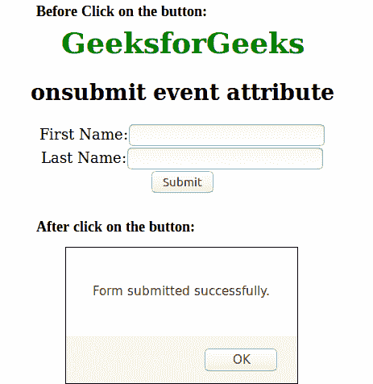

# HTML | onsubmit 事件属性

> 原文:[https://www . geesforgeks . org/html-onsubmit-event-attribute/](https://www.geeksforgeeks.org/html-onsubmit-event-attribute/)

当提交表单时，会触发 HTML 中的 onsubmit 事件属性。
**支持的标签:**

*   **<形态>**

**语法:**

```html
<form onsubmit = "script">
```

**属性值:**该属性包含单值*脚本*，在提交事件调用时有效。
**注意:**该属性只能在表单标签内使用。
**例:**

## 超文本标记语言

```html
<!DOCTYPE html >
<html>
    <head>
        <title>onsubmit event attribute</title>
        <style>
            body {
                text-align:center;
            }
            h1 {
                color:green;
            }
        </style>
        <script>
            function Geeks() {
                alert("Form submitted successfully.") ;
            }
        </script >
    </head>
    <body>
        <h1>GeeksforGeeks</h1>
        <h2>onsubmit event attribute</h2>
        <form onsubmit = "Geeks()">
            First Name:<input type = "text" value = "" /><br/>
            Last Name:<input type = "text" value = "" /><br/>
            <input type = "submit" value = "Submit" />
        </form>
    </body>
</html>                   
```

**输出:**



**支持的浏览器:**onsubmit 事件属性支持的浏览器如下:

*   谷歌 Chrome
*   微软公司出品的 web 浏览器
*   歌剧
*   火狐浏览器
*   旅行队