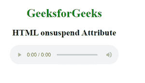
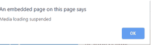

# HTML on uspend 属性

> 原文:[https://www.geeksforgeeks.org/html-onsuspend-attribute/](https://www.geeksforgeeks.org/html-onsuspend-attribute/)

**HTML on uspend 是一个事件**属性，当浏览器没有获得媒体数据时发生。当媒体加载暂停时，会发生此事件。当下载完成或由于某种中断而暂停时，可能会发生这种情况。

**用法:**用于<音频>和<视频>标签，

**语法:**

```html
<element onsuspend="Script">
```

**属性值**:该属性包含单值脚本，在调用暂停事件属性时工作

示例:

## 超文本标记语言

```html
<!DOCTYPE html>
<html>

<head>
    <title>
        HTML onsuspend Attribute
    </title>
</head>

<body>
    <center>
        <h1 style="color:green">GeeksforGeeks</h1>
        <h2>HTML onsuspend Attribute</h2>

        <audio controls id-"audioID">
            <source src="beep.mp3" type="audio/mpeg">
        </audio>
    </center>
    <script>
        document.getElementById(
            "audioID").addEventListener("suspend", GFGfun);

        function GFGfun() {
            alert(
                "Media loading suspended");
        }
    </script>

</body>

</html>
```

**输出:**

 

**支持的浏览器:**

*   谷歌 Chrome
*   微软公司出品的 web 浏览器
*   火狐浏览器
*   歌剧
*   旅行队