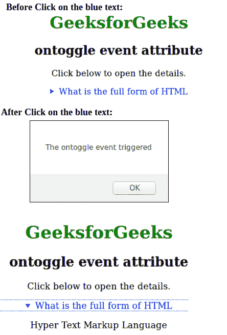

# HTML |本体事件属性

> 原文:[https://www . geesforgeks . org/html-ontogle-event-attribute/](https://www.geeksforgeeks.org/html-ontoggle-event-attribute/)

当用户打开或关闭

<details>元素时，触发本体扭曲事件。<details>元素用于提供附加信息/细节，用户可以根据需要查看或隐藏细节。
**支持的标签:**</details></details>

*   **<详情>**

**语法:**

```html
<details ontoggle = "script">
```

**属性值:**该属性包含单个值*脚本*，在发生事件调用时有效。
**注:**该属性配合细节标签使用。
**例:**

## 超文本标记语言

```html
<!DOCTYPE html >
<html>
    <head>
        <title>ontoggle event attribute</title>
        <style>
            body {
                text-align:center;
            }
            h1 {
                color:green;
            }
        </style>
    </head>
    <body>
        <h1>GeeksforGeeks</h1>
        <h2>ontoggle event attribute</h2>

<p>Click below to open the details.</p>

        <details ontoggle="Geeks()">
            <summary style="color:blue";>What is the full
            form of HTML</summary>

<p>Hyper Text Markup Language</p>

        </details>
        <script>
            function Geeks() {
            alert("The ontoggle event triggered");
            }
        </script>
    </body>
</html>                       
```

**输出:**



**支持的浏览器:**本体事件属性支持的浏览器如下:

*   谷歌 Chrome 12.0
*   Opera 15.0
*   Firefox 48.0
*   Safari 6.0