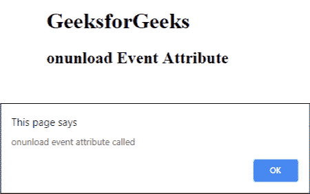

# HTML |未加载事件属性

> 原文:[https://www . geesforgeks . org/html-onunload-event-attribute/](https://www.geeksforgeeks.org/html-onunload-event-attribute/)

onunload 事件属性在卸载文档时起作用，即在浏览器关闭时发生。多用于用户打开链接提交表单关闭浏览器窗口时。
**支持的标签:**

*   **<体>**

**语法:**

```html
<element onunload = "script">
```

**属性值:**该属性包含单值*脚本*，在空载事件触发时生效。
**例:**

## 超文本标记语言

```html
<!DOCTYPE html>
<html>
    <head>
        <title>
            HTML onunload Event Attribute
        </title>

        <script>
            function Geeks() {
                alert("onunload event attribute called");
            }
        </script>
    </head>

    <body onunload = "Geeks()">
        <h1>GeeksforGeeks</h1>

        <h2>onunload Event Attribute</h2>

    </body>
</html>                                   
```

**输出:**



**注意:**此事件可能不会总是如预期的那样工作。
**支持的浏览器:**非加载事件属性支持的浏览器如下:

*   谷歌 Chrome
*   微软公司出品的 web 浏览器
*   火狐浏览器
*   旅行队
*   歌剧