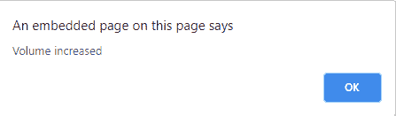

# HTML onvolumechange 属性

> 原文:[https://www . geeksforgeeks . org/html-onvolumechange-attribute/](https://www.geeksforgeeks.org/html-onvolumechange-attribute/)

HTML strong onvolumechange 属性是媒体卷更改时发生的事件属性。使用 volume 属性设置/返回媒体的音量。仅当音量增大或减小、静音或取消静音时，才会调用这些事件。

**支持的标签:**

*   **<音频>**
*   **<视频>**

**语法:**

```html
<element onvolumechange="myScript">
```

**属性值:**该属性包含一个单值脚本，在 volumechange 事件属性调用时工作。该属性由 [**<【音频】>**](https://www.geeksforgeeks.org/html5-audio/)[**<和【视频】>**](https://www.geeksforgeeks.org/html5-video/) 标签支持。

下面的例子说明了 HTML 中的 HTML onvolumechange 属性:

**示例 1:** 在本例中，我们将在音频标签上使用 onvolumechange 属性。

## 超文本标记语言

```html
<!DOCTYPE html>
<html>
    <head>
        <title>
            HTML onvolumechange Attribute
        </title>
    </head>

    <body>
        <center>
            <h1 style="color: green;">GeeksforGeeks</h1>
            <h2>HTML onvolumechange Attribute</h2>

            <audio controls id="audioID">
                <source src=
"https://media.geeksforgeeks.org/wp-content/uploads/20190625153922/frog.mp3"
                        type="audio/mpeg" />
            </audio>
        </center>
        <script>
            document.getElementById(
              "audioID").addEventListener("volumechange", GFGfun);

            function GFGfun() {
                alert("Volume increased");
            }
        </script>
    </body>
</html>
```

**输出:**

[](https://media.geeksforgeeks.org/wp-content/uploads/20200809005650/g.png)

**之后:**

[](https://media.geeksforgeeks.org/wp-content/uploads/20200809005837/arit.png)

**示例 2:** 在本例中，我们将在视频标签上使用 onvolumechange 属性。

## 超文本标记语言

```html
<!DOCTYPE html>
<html>
    <head>
        <title>
            HTML onvolumechange Attribute
        </title>
    </head>

    <body>
        <center>
            <h1 style="color: green;">GeeksforGeeks</h1>
            <h2>HTML onvolumechange Attribute</h2>

            <video controls id="videoID" width="340" height="240">
                <source src=
"https://media.geeksforgeeks.org/wp-content/uploads/20190401140735/g4g2.mp4"
                        type="video/mp4" />
            </video>
        </center>
        <script>
            document.getElementById(
              "videoID").addEventListener("volumechange", GFGfun);

            function GFGfun() {
                alert("Volume changed");
            }
        </script>
    </body>
</html>
```

**输出:**

[](https://media.geeksforgeeks.org/wp-content/uploads/20200811000813/crop.png)

**之后:**

[](https://media.geeksforgeeks.org/wp-content/uploads/20200811000903/bro.png)

**支持的浏览器:**

1.  谷歌 Chrome
2.  微软公司出品的 web 浏览器
3.  火狐浏览器
4.  苹果 Safari
5.  歌剧