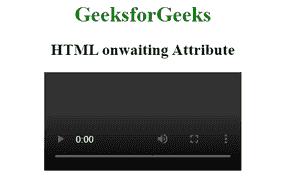
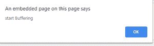

# 等待属性上的 HTML】

> 原文:[https://www.geeksforgeeks.org/html-onwaiting-attribute/](https://www.geeksforgeeks.org/html-onwaiting-attribute/)

**HTML onwaiting 属性**是当音频或视频停止缓冲下一帧时发生的事件属性。它可以用于音频和视频标签。

**适用:**

*   **<音频>**
*   **<视频>**

**语法:**

```html
<element onwaiting="Script">
```

**属性值**:该属性包含单值脚本，用于等待事件属性调用

**示例:**

## 超文本标记语言

```html
<!DOCTYPE html>
<html>

<head>
    <title>HTML DOM onwaiting Attribute</title>
</head>

<body>
    <center>
        <h1 style="color:green">GeeksforGeeks</h1>
        <h2>HTML onwaiting Attribute</h2>

        <video controls id="videoID">
            <source src="GFG.mp4" type="video/mp4">
        </video>

    </center>
    <script>
        document.getElementById(
        "videoID").addEventListener("waiting", GFGfun);

        function GFGfun() {
            alert(" start Buffering");
        }
    </script>

</body>

</html>
```

**输出:**

 