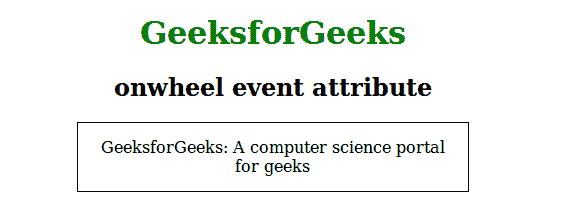
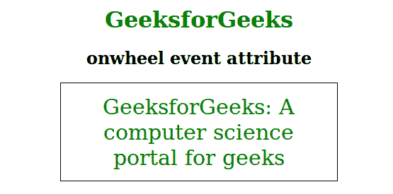

# HTML | onwheel 事件属性

> 原文:[https://www.geeksforgeeks.org/html-onwheel-event-attribute/](https://www.geeksforgeeks.org/html-onwheel-event-attribute/)

当指针设备的滚轮在元素上向上或向下滚动时，此属性有效。当用户使用鼠标或触摸板滚动或缩放元素时，onwheel 属性也有效。
**支持的标签:**支持所有 HTML 元素。

**语法:**

```html
<element onwheel = "script">
```

**属性值:**该属性包含单值脚本，在轮属性被调用时有效。所有 HTML 元素都支持它。
**注意:**这个属性在 HTML 5 中是新的。
**例:**

## 超文本标记语言

```html
<!DOCTYPE html>
<html>
    <head>
        <title>onwheel event attribute</title>
        <style>
            #geeks {
                border: 1px solid black;
                padding:15px;
                width:60%;
            }
            h1 {
                color:green;
            }
        </style>
    </head>
    <body>
        <center>
        <h1>GeeksforGeeks</h1>
        <h2>onwheel event attribute</h2>
        <div id = "geeks" onwheel="Function()">GeeksforGeeks:
        A computer science portal for geeks</div>
        <script>
            function Function() {
                document.getElementById("geeks").style.fontSize = "30px";
                document.getElementById("geeks").style.color = "green";
            }
        </script>
        </center>
    </body>
</html>
```

**输出:**
**前:**



**之后:**



**支持的浏览器:**滚轮事件属性支持的浏览器如下:

*   Chrome 31.0
*   Internet Explorer 9.0
*   Firefox 17.0
*   Safari:不支持
*   Opera 18.0