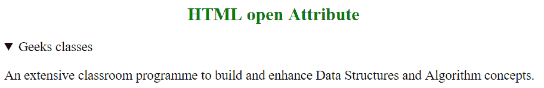

# HTML |打开属性

> 原文:[https://www.geeksforgeeks.org/html-open-attribute/](https://www.geeksforgeeks.org/html-open-attribute/)

HTML 中的 open 属性用于指示详细信息是否会在页面加载时显示。这是一个布尔属性。如果默认情况下不存在，则不显示详细信息。
**注意:**此属性仅被<细节>元素使用。

**适用:**

*   [**<详情>**](https://www.geeksforgeeks.org/html-details-open-attribute/?ref=rp)
*   [**<对话>**](https://www.geeksforgeeks.org/html-dialog-open-attribute/?ref=rp)

**语法:**

```html
<details open> content... </details>
```

**例:**

## 超文本标记语言

```html
<!-- HTML program to illustrate open Attribute -->

<!DOCTYPE html>
<html>
    <head>
        <title>HTML open Attribute</title>
    </head>
    <body>
        <h2 style = "color: green; text-align: center;">
            HTML open Attribute
        </h2>

        <!-- Below details tag has "open" attribute -->
        <details open>
            <summary>Geeks classes</summary>

<p>
                An extensive classroom programme to build
                and enhance Data Structures and Algorithm
                concepts.
            </p>

        </details>
    </body>
</html>                   
```

**输出:**



**支持的浏览器:**开放属性支持的浏览器如下:

*   苹果 Safari 6.0
*   谷歌 Chrome 12.0
*   火狐不支持
*   Opera 15.0
*   不支持 Internet Explorer