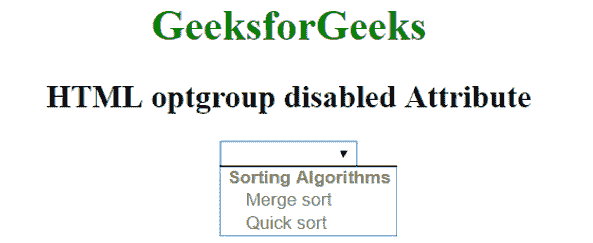

# HTML optgroup 禁用属性

> 原文:[https://www . geesforgeks . org/html-opt group-disabled-attribute/](https://www.geeksforgeeks.org/html-optgroup-disabled-attribute/)

HTML 中<选项组>元素的**禁用**属性用于指定选项组被禁用。禁用的 optgroup 不可点击且不可用。它是一个布尔属性。

**语法:**

```html
<optgroup disabled>option value...</optgroup>

```

**示例:**

```html
<!DOCTYPE html> 
<html> 
    <head> 
        <title>HTML <optgroup> disabled Attribute</title> 
    </head> 

    <body style = "text-align:center">    
        <h1 style = "color: green;">GeeksforGeeks</h1>
        <h2>HTML optgroup disabled Attribute</h2>

        <select>
            <!--A disabled optgroup-->
            <optgroup label="Sorting Algorithms" disabled>
                <option value="merge">Merge sort</option>
                <option value="quick">Quick sort</option>
            </optgroup>
        </select>
    </body> 
</html>    
```

**输出:**


**支持的浏览器:**禁用属性<选项组>支持的浏览器如下:

*   苹果 Safari
*   谷歌 Chrome 1.0
*   Firefox 1.0
*   歌剧
*   Internet Explorer 8.0