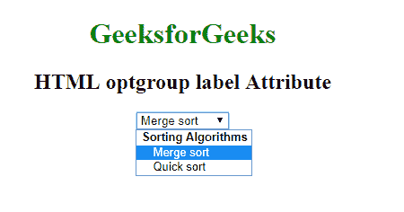

# HTML | optgroup 标签属性

> 原文:[https://www . geesforgeks . org/html-opt group-label-attribute/](https://www.geeksforgeeks.org/html-optgroup-label-attribute/)

**HTML optgroup 标签属性**用于为 **< optgroup >** 元素指定标签。

**语法:**

```html
<optgroup label="text"> 
```

**属性值:**它包含值，即**文本**，该文本指定了眼图元素的描述。

**示例:**

```html
<!DOCTYPE html>
<html>

<head>
    <title>HTML
        <optgroup>
            label Attribute
    </title>
</head>

<body style="text-align:center">
    <h1 style="color: green;">
      GeeksforGeeks
  </h1>
    <h2>HTML optgroup label Attribute</h2>

    <select>
        <!--A label optgroup-->
        <optgroup label="Sorting Algorithms">
            <option value="merge">
                Merge sort
            </option>
            <option value="quick">
                Quick sort
            </option>
        </optgroup>
    </select>
</body>

</html>
```

**输出:**


**支持的浏览器:****HTML opt group 标签属性**支持的浏览器如下:

*   谷歌 Chrome
*   微软公司出品的 web 浏览器
*   火狐浏览器
*   苹果 Safari
*   歌剧