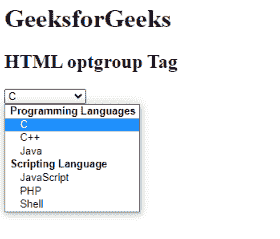
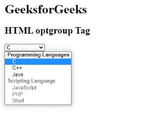

# HTML optgroup 标签

> 哎哎哎:# t0]https://www . geeksforgeeks . org/html-opt group 标签/

此标签用于在下拉列表中创建一组相同的类别选项。当存在一长串项目时，需要<optgroup>标签。
**语法:**</optgroup>

```html
<optgroup>
      <option>..</option>
        .
        .
</optgroup>
```

**属性:**

*   [**标签**](https://www.geeksforgeeks.org/html-optgroup-label-attribute/#:~:text=The%20HTML%20optgroup%20label%20Attribute,for%20an%20Element.&text=Attribute%20Values%3A%20It%20contains%20the,description%20for%20a%20optgroup%20Element.) **:** 用于指定 optgroup 的标签。
*   [**禁用**](https://www.geeksforgeeks.org/html-optgroup-disabled-attribute/#:~:text=HTML%20disabled%20Attribute,-Difficulty%20Level%20%3A%20Basic&text=The%20disabled%20attribute%20for%20%3Coptgroup,It%20is%20a%20boolean%20attribute.) **:用于禁用列表中的选项-组。**

**例 1:**

## 超文本标记语言

```html
<!DOCTYPE html>
<html>

<body>
    <h1>GeeksforGeeks</h1>
    <h2>HTML optgroup Tag</h2>
    <select>
        <!-- optgroup tag starts -->
            <optgroup label="Programming Languages">
                <option value="C">C</option>
                <option value="C++">C++</option>
                <option value="Java">Java</option>
            </optgroup>
            <optgroup label="Scripting Language">
                <option value="JavaScript">JavaScript</option>
                <option value="PHP">PHP</option>
                <option value="Shell">Shell</option>
            </optgroup>
        <!-- optgroup tag ends     -->
        </select>
</body>

</html>
```

**输出:**



**例 2:**

## 超文本标记语言

```html
<!DOCTYPE html>
<html>

<body>
    <h1>GeeksforGeeks</h1>
    <h2>HTML optgroup Tag</h2>
    <select>
        <!-- optgroup tag starts -->
            <optgroup label="Programming Languages">
                <option value="C">C</option>
                <option value="C++">C++</option>
                <option value="Java">Java</option>
            </optgroup>
            <optgroup label="Scripting Language" disabled>
                <option value="JavaScript">JavaScript</option>
                <option value="PHP">PHP</option>
                <option value="Shell">Shell</option>
            </optgroup>
        <!-- optgroup tag ends -->
        </select>
</body>

</html>
```

**输出:**



**支持的浏览器:**

*   谷歌 Chrome
*   微软公司出品的 web 浏览器
*   火狐浏览器
*   歌剧
*   旅行队