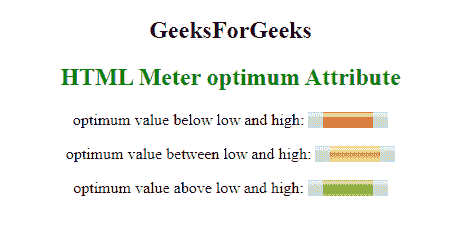

# HTML |最佳属性

> 原文:[https://www.geeksforgeeks.org/html-optimum-attribute-2/](https://www.geeksforgeeks.org/html-optimum-attribute-2/)

HTML 中的 **HTML <仪表>最佳属性**表示仪表的最佳数值。它必须在最小值和最大值之间的范围内。当它与“低”和“高”属性一起使用时，它会指示沿着范围的哪个位置被认为是优选的。
**语法:**

```html
<meter optimum="number">
```

**属性值**

*   **数字:**包含代表仪表最佳值的浮点数。

**示例:**

## 超文本标记语言

```html
<!DOCTYPE html>
<html>

<head>
    <title>
      HTML Meter optimum Attribute
  </title>
</head>

<body>
    <center>
        <h2>
            GeeksForGeeks
        </h2>
        <h2 style="color: green;"> 
            HTML Meter optimum Attribute 
        </h2>

<p>
            optimum value below low and high:
            <meter value="0.6" 
                   max="0.9" 
                   min="0.1" 
                   optimum="0.1"
                   high="0.5" 
                   low="0.2">
            </meter>
        </p>

<p>
            optimum value between low and high:
            <meter value="0.6" 
                   max="0.9"
                   min="0.1"
                   optimum="0.4"
                   high="0.5"
                   low="0.2">
            </meter>
        </p>

<p>
            optimum value above low and high:
            <meter value="0.6"
                   max="0.9" 
                   min="0.1"
                   optimum="0.6"
                   high="0.5" 
                   low="0.2">
            </meter>
        </p>

    </center>
</body>

</html>
```

**输出:**



**支持的浏览器:**以下是 **HTML <仪表>最佳属性**支持的浏览器:

*   谷歌 Chrome 8.0
*   Firefox 16.0
*   Internet Explorer 13.0
*   苹果 Safari 6.0
*   歌剧 11.5