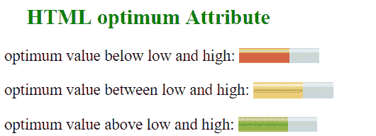

# HTML |最佳属性

> 原文:[https://www.geeksforgeeks.org/html-optimum-attribute/](https://www.geeksforgeeks.org/html-optimum-attribute/)

HTML 中的最佳属性表示仪表的最佳数值。它必须在最小值和最大值之间的范围内。当它与“低”和“高”属性一起使用时，它会指示沿着范围的哪个位置被认为是优选的。
**用法:**与<米>元素搭配使用。
**语法:**

```html
<meter optimum = "value"></meter>
```

**属性值:**包含代表仪表最佳值的浮点数。

**示例:**

## 超文本标记语言

```html
<!DOCTYPE html>
<html>
    <head>
        <title>HTML optimum Attribute</title>
    </head>
    <body>

        <h2 style = "color: green;">
            HTML optimum Attribute
        </h2>

<p>
            optimum value below low and high:
            <meter value="0.6" max="0.9" min="0.1"
                   optimum="0.1" high = "0.5" low = "0.2">
            </meter>
        </p>

<p>
            optimum value between low and high:
            <meter value="0.6" max="0.9" min="0.1"
                   optimum="0.4" high = "0.5" low = "0.2">
            </meter>
        </p>

<p>
            optimum value above low and high:
            <meter value="0.6" max="0.9" min="0.1"
                   optimum="0.6" high = "0.5" low = "0.2">
            </meter>
        </p>

    </body>
</html>
```



**支持的浏览器:**由*最优*属性支持的浏览器如下:

*   谷歌 Chrome 8.0
*   Firefox 6.0
*   Opera 11.0
*   Safari 6.0