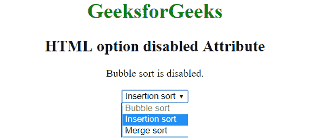

# HTML option 禁用属性

> 原文:[https://www . geesforgeks . org/html-option-disabled-attribute/](https://www.geeksforgeeks.org/html-option-disabled-attribute/)

HTML 中<选项>元素的**禁用**属性用于指定选项值被禁用。禁用的选项不可点击且不可用。它是一个布尔属性。

**语法:**

```html
<option disabled>option values...</option>

```

**示例:**

```html
<!DOCTYPE html> 
<html> 
    <head> 
        <title>HTML option disabled Attribute</title> 
    </head> 

    <body style = "text-align:center">    
        <h1 style = "color: green;">GeeksforGeeks</h1>
        <h2>HTML option disabled Attribute</h2>

        <p>Bubble sort is disabled.</p>
        <select>
            <!--A disabled option-->
            <option value="bubble" disabled>Bubble sort</option>
            <option value="insertion">Insertion sort</option>
            <option value="merge">Merge sort</option>
        </select><br>
    </body> 
</html> 
```

**输出:**


**支持的浏览器:**禁用属性<选项>支持的浏览器如下:

*   苹果 Safari
*   谷歌 Chrome 1.0
*   Firefox 1.0
*   歌剧
*   Internet Explorer 8.0