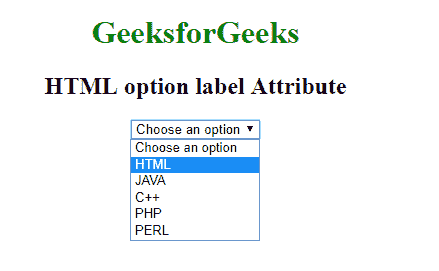

# HTML | option 标签属性

> 原文:[https://www.geeksforgeeks.org/html-option-label-attribute/](https://www.geeksforgeeks.org/html-option-label-attribute/)

**HTML 选项标签属性**用于指定代表选项短标签的文本值。最短的版本将显示在下拉列表中。

**语法:**

```html
<option label="text">
```

**属性值:**它包含单个值**文本**，该文本指定选项的较短版本。

以下示例说明了标签属性在选项元素中的使用。
**例:**

```html
<!DOCTYPE html> 
<html> 

<head> 
    <title>
        HTML option label attribute
    </title> 

    <style> 
        body { 
            text-align:center; 
        } 
        h1 { 
            color:green; 
        } 
    </style> 
</head> 

<body> 
    <h1>GeeksforGeeks</h1> 

    <h2>HTML option label Attribute</h2> 

    <select> 
        <option>Choose an option</option> 
        <option label="HTML">HTML Language</option> 
        <option label="JAVA">JAVA Programming</option> 
        <option label="C++">C++ Programming</option> 
        <option label="PHP">PHP Programming</option> 
        <option label="PERL">PERL Programming</option> 
    </select> 
</body> 

</html>             
```

**输出:**


**支持的浏览器:**HTML<选项>标签属性支持的浏览器如下:

*   谷歌 Chrome
*   Internet Explorer 8.0
*   旅行队
*   歌剧