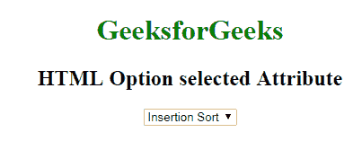
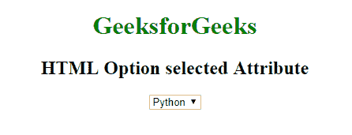

# HTML | option 选中属性

> 原文:[https://www . geesforgeks . org/html-option-selected-attribute/](https://www.geeksforgeeks.org/html-option-selected-attribute/)

选择的 **HTML <选项>属性**用于指定*页面加载*时默认选择哪个选项。这是一个布尔属性。默认情况下，将显示具有选定属性的选项。
**语法:**

```html
<option selected> 
```

**示例-1:** 本示例说明了在选项元素中所选属性的使用。

## 超文本标记语言

```html
<!-- HTML program to illustrate selected Attribute -->

<!DOCTYPE html>
<html>

<head>
    <title>HTML selected Attribute</title>
</head>

<body style="text-align: center;">
    <h1 style="color: green;">GeeksforGeeks</h1>
    <h2>HTML Option selected Attribute</h2>

    <!-- List of Options -->
    <select>
        <option value="merge">Merge Sort</option>
        <option value="bubble">Bubble Sort</option>
        <option value="insertion">Insertion Sort</option>

        <!-- Option element with selected attribute -->
        <option value="quick" selected>Quick Sort</option>
    </select>
</body>

</html>
```

**输出:**



**示例-2:**

## 超文本标记语言

```html
<!-- HTML program to illustrate selected Attribute -->

<!DOCTYPE html>
<html>

<head>
    <title>HTML selected Attribute</title>
</head>

<body style="text-align: center;">
    <h1 style="color: green;">GeeksforGeeks</h1>
    <h2>HTML Option selected Attribute</h2>

    <!-- List of Options -->
    <select>
        <option value="c">C</option>
        <option value="cpp">C++</option>
<!-- Option element with selected attribute -->
        <option value="python" selected>Python</option>
        <option value="java" >JAVA</option>
    </select>
</body>

</html>                   
```

**输出:**



**支持的浏览器:****HTML 选项选择属性**支持的浏览器如下:

*   谷歌 Chrome
*   微软公司出品的 web 浏览器
*   火狐浏览器
*   歌剧
*   旅行队